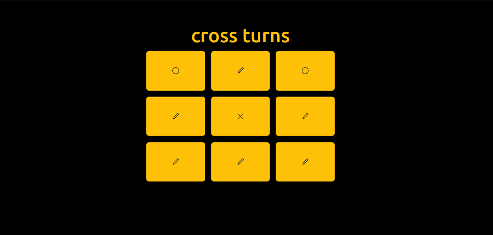

# TicTacToe using ReactJs

## Technologies used in this project:

# Preview of this project:

## Winning Screen:

## Error Screen:

> appear when you click on already filled square

***

## Winner Toast Message:

> appear only when you click on board after winner is declared

***

## Live project here: 

#### [Live Project Here](https://geekyjedy-ttt.netlify.app/ "Netlify Live Project Link")

